<meta http-equiv="Content-Type" content="text/html; charset=utf-8"/>
<table>
<tr><td>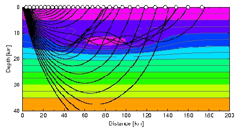</td>
<td bgcolor="#CDCDCD" style="width:600px">
<h1>Numerical methods in Geosciences</h1>
<h2>Georg Kaufmann</h2>
</td>
</tr>
</table>

Master course tought at [Freie Universität Berlin](http://fu-berlin.de) in the 
**M.Sc. Geological Sciences** program.

## Course summary

This lecture provides an introduction to **numerical methods** with an emphasis to **geosciences**. The following topics will be discussed:

- We discuss the concept of **numerical methods** and their **accuracy**.
- We introduce the **Taylor series** as a fundamental expansion for numerical methods.
- We derive several methods for numerically **finding roots**.
- We discuss numerical **differentiation** and **integration** methods.
- We solve **linear systems of equations** with direct and iterative methods.
- We explore optimisation methods based on **machine-learning strategies**.
- We solve **ordinary and partial differential equations** with a variety of methods.

## Course instructor

[Georg Kaufmann](http://userpage.fu-berlin.de/~geodyn)<br>
Freie Universität Berlin<br>
Department of Geosciences, Institute of Geological Sciences, Geophysics Section<br>
Malteserstr. 74-100, 12249 Berlin, Haus D, Raum D127<br>
[georg.kaufmann@fu-berlin.de](mailto:georg.kaufmann@fu-berlin.de)

## Course How-To

- You should follow the lectures, preferrably in consecutive order.
- In each lecture, we start with an overview, then as main part the self-learning lecture notes can be downloaded.
- Then, a practical part follows, which is often a link to a python page for simple programming exercises, or some homework.

## Lectures

The lecture series is compiled as handouts in **pdf** format
(click on title):

<table>
<tr>
<td style="height: 30px;vertical-align:top;text-align:center">
<a href='handouts/Lecture_Numerics_00_Overview_handout.pdf'>0. Overview</a> <br></td>
<td style="height: 30px;vertical-align:top;text-align:center">
<a href='handouts/Lecture_Numerics_01_Introduction_handout.pdf'>1. Introduction</a> <br>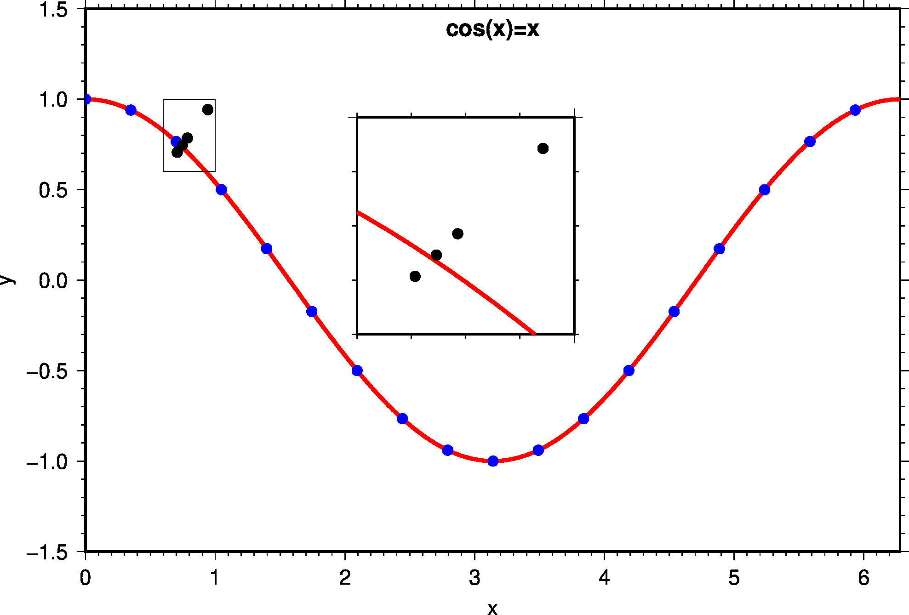</td>
<td style="height: 30px;vertical-align:top;text-align:center">
<a href='handouts/Lecture_Numerics_02_Basics_handout.pdf'>2. Basics</a> <br>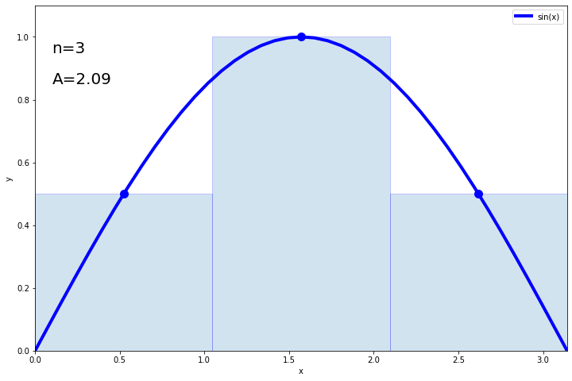</td>
</tr>
<tr>
<td style="height: 30px;vertical-align:top;text-align:center">
<a href='handouts/Lecture_Numerics_03_Roots_handout.pdf'>3. Roots</a> <br>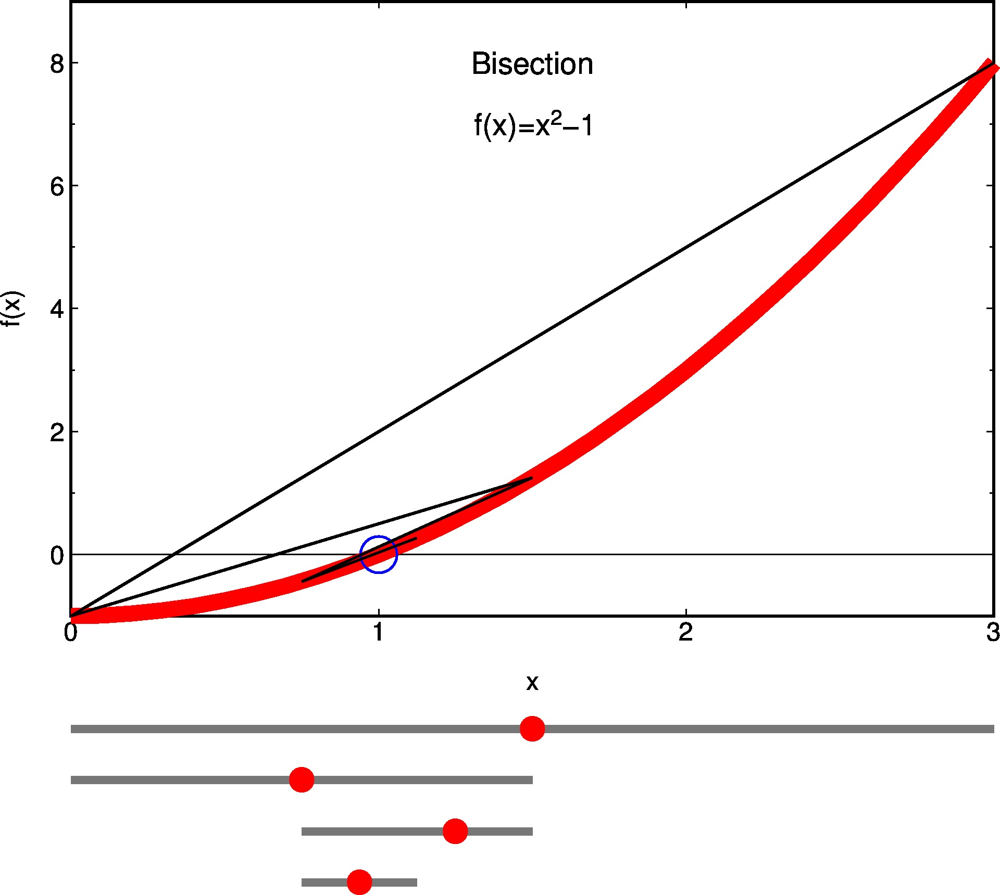</td>
<td style="height: 30px;vertical-align:top;text-align:center">
<a href='handouts/Lecture_Numerics_04_Interpolation_handout.pdf'>4. Interpolation</a> <br>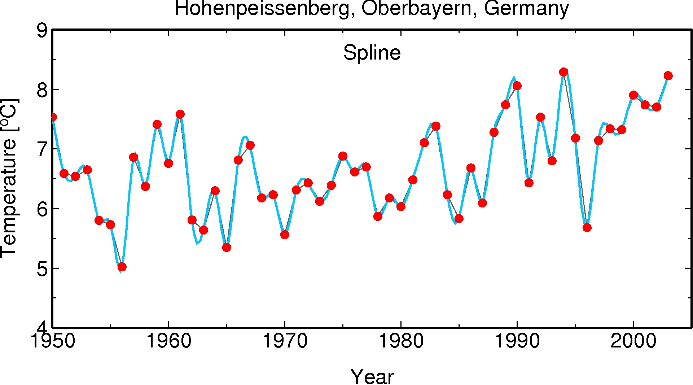</td>
<td style="height: 30px;vertical-align:top;text-align:center">
<a href='handouts/Lecture_Numerics_05_Differentiation_handout.pdf'>5. Differentiaton</a> <br>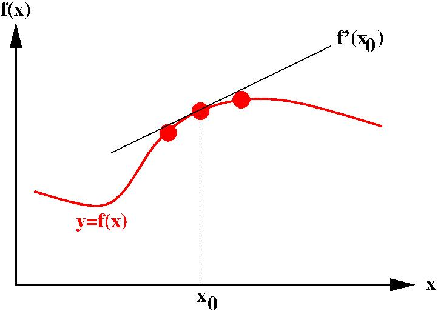</td>
</tr>
<tr>
<td style="height: 30px;vertical-align:top;text-align:center">
<a href='handouts/Lecture_Numerics_06_Integration_handout.pdf'>6. Integration</a> <br>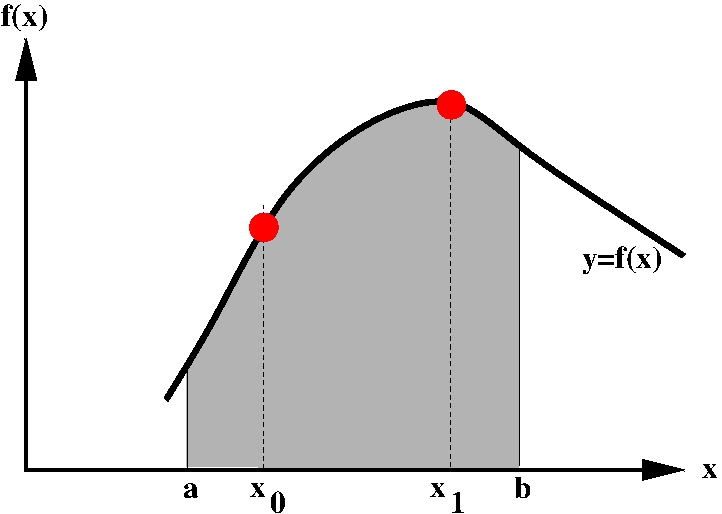</td>
<td style="height: 30px;vertical-align:top;text-align:center">
<a href='handouts/Lecture_Numerics_07_Linear_Systems1_handout.pdf'>7. Linear systems</a> <br>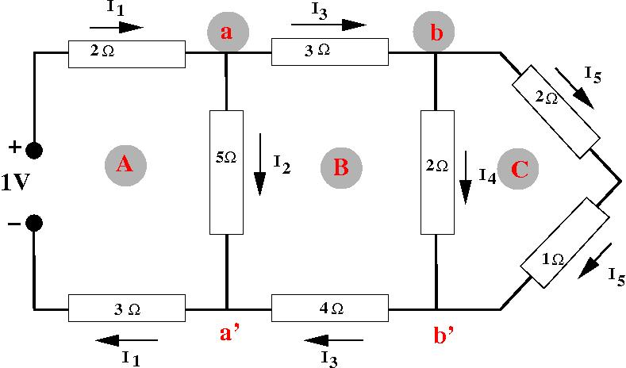</td>
<td style="height: 30px;vertical-align:top;text-align:center">
<a href='handouts/Lecture_Numerics_08_Optimization_handout.pdf'>8. Optimisation</a> <br>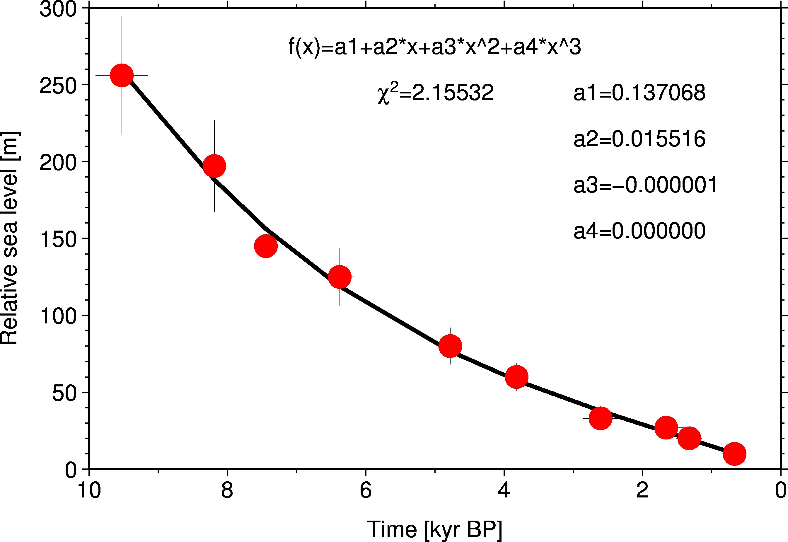</td>
</tr>
<tr>
<td style="height: 30px;vertical-align:top;text-align:center">
<a href='handouts/Lecture_Numerics_09_ODE1_handout.pdf'>9. Initial-value problem</a> <br>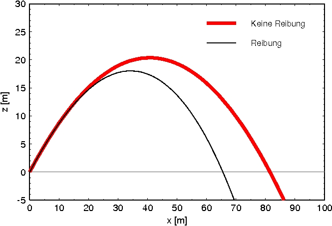</td>
<td style="height: 30px;vertical-align:top;text-align:center">
<a href='handouts/Lecture_Numerics_10_ODE2_handout.pdf'>10. Boundary-value problem</a> <br>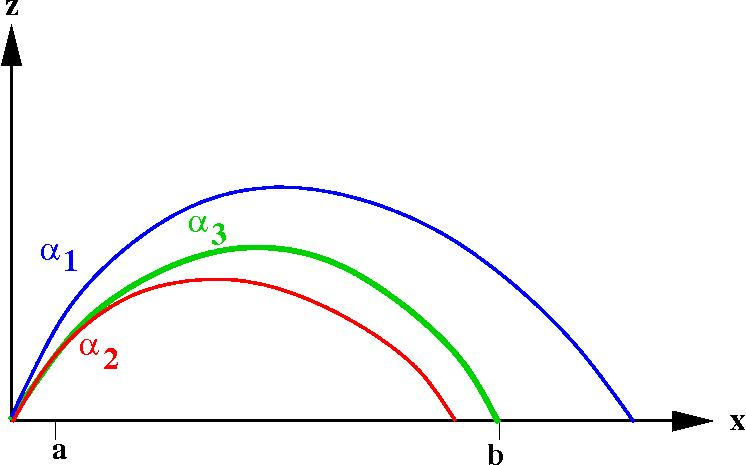</td>
<td style="height: 30px;vertical-align:top;text-align:center">
<a href='handouts/Lecture_Numerics_11_PDE1_handout.pdf'>11. Finite differences</a> <br></td>
</tr>
</table>

## Exercises

The exercises are mainly **jupyter** notebooks, which can be accessed interactively through<br>
[](https://mybinder.org/v2/gh/georgkaufmann/lecture_numerics.git/main?filepath=index.ipynb)

A list of notebooks can be found here:

- <a href="README_Notebooks.md" target="_blank">List of Juypter notebooks</a>

## Download
```
git clone https://github.com/georgkaufmann/lecture_numerics.git
```

## Versioning

We use [Git](https://git-scm.com/) for versioning.

## Authors

* **Georg Kaufmann** - *Initial work* - [Georg Kaufmann](http://userpage.fu-berlin.de/~geodyn)


## License

This project is licensed for classroom use only.

## Acknowledgments
